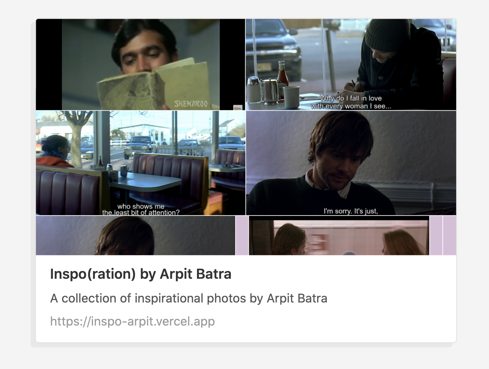

# Inspo(ration)

</img>

# What is this?

A collection of inspirational screenshots

# What inspired this?

[lew's big ass inspo repo™](https://github.com/torvim/inspo)

# What amalgam of technologies is used to build this?

- [11ty](https://www.11ty.dev/)
- [SCSS](https://sass-lang.com/documentation/syntax)
- [Fancybox](http://fancyapps.com/fancybox/3/)

